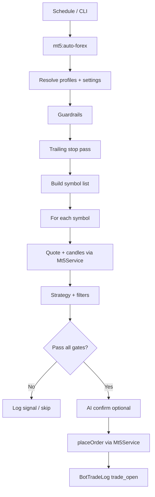
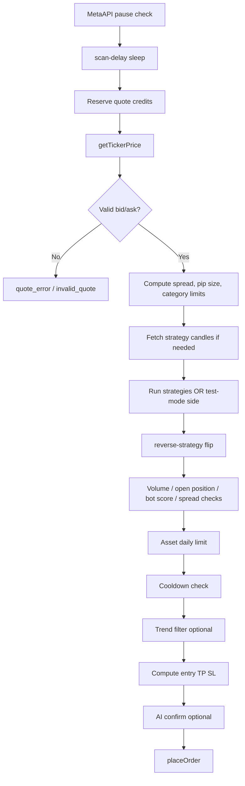

# `routes/console.php` — Complete Reference

This document describes everything in `routes/console.php`: Artisan commands, scheduling, configuration resolution, guardrails, symbol scanning, strategy flow, logging, and the auto-learning command.

For the split between this file and `Mt5Service`, see also [`app/Services/console-vs-mt5service.md`](../app/Services/console-vs-mt5service.md).

---

## Table of contents

1. [Purpose and architecture](#1-purpose-and-architecture)
2. [Dependencies](#2-dependencies)
3. [Commands overview](#3-commands-overview)
4. [`mt5:auto-forex`](#4-mt5auto-forex)
5. [Configuration resolution](#5-configuration-resolution)
6. [Bot profiles](#6-bot-profiles)
7. [CLI options reference](#7-cli-options-reference)
8. [Internal helpers](#8-internal-helpers)
9. [Instrument categories](#9-instrument-categories)
10. [Cycle lifecycle](#10-cycle-lifecycle)
11. [Guardrails (pre-scan)](#11-guardrails-pre-scan)
12. [Trailing stops (pre-scan)](#12-trailing-stops-pre-scan)
13. [Symbol universe](#13-symbol-universe)
14. [Per-symbol scan pipeline](#14-per-symbol-scan-pipeline)
15. [Strategy evaluation](#15-strategy-evaluation)
16. [Reverse strategy](#16-reverse-strategy)
17. [Bot score](#17-bot-score)
18. [Trend filter](#18-trend-filter)
19. [AI confirmation](#19-ai-confirmation)
20. [Trade execution](#20-trade-execution)
21. [Logging (`BotTradeLog`)](#21-logging-bottradelog)
22. [Cache keys](#22-cache-keys)
23. [MetaAPI credit budget](#23-metaapi-credit-budget)
24. [MetaAPI outage / rate limit handling](#24-metaapi-outage--rate-limit-handling)
25. [Cycle summary output](#25-cycle-summary-output)
26. [`mt5:learn-policy`](#26-mt5learn-policy)
27. [Scheduler](#27-scheduler)
28. [Operational examples](#28-operational-examples)
29. [Related files](#29-related-files)

---

## 1. Purpose and architecture

`routes/console.php` is Laravel’s console route file. In this project it is the **bot brain**: it decides *when*, *what*, and *whether* to trade. It does **not** talk to MetaAPI directly except through injected services.

| Layer | File | Responsibility |
|-------|------|----------------|
| Decision / orchestration | `routes/console.php` | Settings, guardrails, strategy, AI gate, logging |
| Broker / MetaAPI | `app/Services/Mt5Service.php` | Quotes, candles, orders, trailing, history |
| Strategies | `app/Services/TradingStrategies/*` | Per-strategy signal evaluation |
| AI | `app/Services/AiService.php` | LLM approve/reject prompts |
| Persistence | `BotTradeLog`, `AppSetting`, `Ticker` | Logs and configuration |



---

## 2. Dependencies

```php
use App\Models\AppSetting;
use App\Models\BotTradeLog;
use App\Models\Ticker;
use App\Services\AiService;
use App\Services\Mt5Service;
use App\Services\TradingStrategies\StrategyFactory;
use Illuminate\Support\Facades\Artisan;
use Illuminate\Support\Facades\Cache;
use Illuminate\Support\Facades\Log;
use Illuminate\Support\Facades\Schedule;
```

Command handlers receive `Mt5Service`, `AiService`, and `StrategyFactory` via Laravel container injection.

---

## 3. Commands overview

| Command | Purpose |
|---------|---------|
| `inspire` | Laravel demo — prints an inspiring quote |
| `mt5:auto-forex` | Main automated trading loop (demo MetaAPI account) |
| `mt5:learn-policy` | Analyze recent trades and recommend/apply profile tuning |

Scheduled job (bottom of file):

```php
Schedule::command('mt5:auto-forex --once')
    ->name('mt5-auto-forex-once')
    ->everyMinute()
    ->withoutOverlapping(120);
```

---

## 4. `mt5:auto-forex`

### Entry structure

The command is one large closure with three nested functions:

| Function | Role |
|----------|------|
| `$resolveProfiles()` | Load enabled bot profiles from `AppSetting::bot_profiles`, normalize keys, filter by `--bot` |
| `$runCycle($botProfile)` | Execute one full scan/trade cycle for a single profile |
| `$runAllBots()` | Loop all resolved profiles and run `$runCycle` for each |

### Run modes

| Mode | Flag | Behavior |
|------|------|----------|
| Single cycle | `--once` | Run all enabled profiles once, then exit |
| Continuous | *(default)* | Run all profiles, sleep 60s, repeat forever |

```bash
php artisan mt5:auto-forex --once --bot=scalper ...
php artisan mt5:auto-forex   # loops every 60s until killed
```

---

## 5. Configuration resolution

Every setting uses the same precedence chain via `$optionOrProfileOrSetting()`:

```
1. CLI flag (only if explicitly passed on argv — detected by $optionProvided)
2. Bot profile JSON field (bot_profiles[].*)
3. AppSetting database column (bot_*)
4. Hard-coded fallback default in console.php
```

**Important:** Passing a flag on the command line overrides profile/DB even when the value matches the default. Omit the flag to use profile/DB.

### `$optionProvided(string $name): bool`

Scans `$_SERVER['argv']` for `--name` or `--name=value`. Used so unset CLI options fall through to profile/DB instead of Laravel’s built-in defaults.

---

## 6. Bot profiles

Profiles live in `app_settings.bot_profiles` (JSON array). Each profile can override any bot parameter.

### Profile normalization (`$resolveProfiles`)

- **`key`**: slug from `profile.key` or `profile.name` (non-alphanumeric → `_`, lowercased)
- **`name`**: display name; defaults to `Bot N`
- **`enabled`**: skipped when `false`
- **`--bot=`**: filter to one profile by key or name (case-insensitive)
- **Empty profiles**: synthetic `default` / `Default Bot` profile is used

### Common profile keys

Supported in UI and JSON (non-exhaustive):

`key`, `name`, `enabled`, `lot`, `tp_pips`, `sl_pips`, `trail_*`, `min_move_pips`, `max_spread_pips`, `cooldown_minutes`, `session_start_utc`, `session_end_utc`, `max_trades_per_day`, `max_trades_per_asset_per_day`, `max_daily_loss_percent`, `ai_confirm`, `ai_min_confidence`, `max_symbols`, `max_open_positions`, `max_per_cycle`, `min_bot_score`, `use_adx_score`, `use_rsi_score`, `adx_min_floor`, `min_effective_volume`, `scalper`, `strategy` / `strategies`, `strategy_params`, `symbols`, `signal_timeframe` / `signal_timeframes`, `entry_timeframe`, `trend_filter`, `reverse_strategy`, `cooldown_override_ratio`, `preferred_hours_utc`, `blocked_hours_utc`, `preferred_symbols`, `ticker_categories`, category override maps (`tp_pips_by_category`, etc.)

Every log row for a cycle includes `bot_key` and `bot_name` from `$botLogDefaults`.

---

## 7. CLI options reference

### Trade sizing & exits

| Option | Default | Description |
|--------|---------|-------------|
| `--lot` | `0.01` | Base lot per order |
| `--tp-pips` | `25` | Take-profit distance in pips |
| `--sl-pips` | `15` | Stop-loss distance in pips |
| `--tp-pips-by-category` | *(auto maps)* | e.g. `forex:25,stock:160,commodity:80,default:25` |
| `--sl-pips-by-category` | *(auto maps)* | Same format |
| `--trail-start-pips` | `10` | Profit pips before trailing activates |
| `--trail-pips` | `8` | Trailing stop distance |
| `--trail-tp-multiplier` | `2` | One-time TP expansion when trailing first fires |
| `--trail-*-by-category` | *(auto maps)* | Per-category trailing overrides |

### Entry filters

| Option | Default | Description |
|--------|---------|-------------|
| `--min-move-pips` | `3` | Minimum price move (used by strategies) |
| `--min-move-pips-by-category` | *(auto maps)* | Category overrides |
| `--max-spread-pips` | `2.5` | Max spread for entry |
| `--max-spread-pips-by-category` | *(auto maps)* | Category overrides |
| `--cooldown-minutes` | `30` | Minutes after successful open before same symbol can trade again |
| `--cooldown-override-ratio` | `0` | If >0, cooldown can be bypassed when current move ≥ last trade move × ratio |

### Session & daily limits

| Option | Default | Description |
|--------|---------|-------------|
| `--session-start-utc` | `6` | UTC hour session start (inclusive) |
| `--session-end-utc` | `20` | UTC hour session end (inclusive) |
| `--max-trades-per-day` | `20` | Max successful `trade_open` logs per bot per calendar day |
| `--max-trades-per-asset-per-day` | `2` | Max successful opens **per symbol** per calendar day |
| `--max-daily-loss-percent` | `2` | Stop entries if equity drawdown from day-start baseline exceeds this % |

### AI & scoring

| Option | Default | Description |
|--------|---------|-------------|
| `--ai-confirm` | `1` | `1` = require AI approval; `0` = skip AI |
| `--ai-min-confidence` | `70` | Minimum parsed confidence % from AI reply |
| `--min-bot-score` | `70` | Minimum composite score to execute and log signals |

### Scanning & capacity

| Option | Default | Description |
|--------|---------|-------------|
| `--max-symbols` | `200` | Symbols scanned per cycle (round-robin window if list is larger) |
| `--scan-delay-ms` | `0` | Sleep between symbol scans |
| `--max-cycle-credits` | `900` | MetaAPI credit budget per cycle (`0` = unlimited tracking only) |
| `--max-open-positions` | `10` | Skip entire cycle if broker open positions ≥ this |
| `--max-per-cycle` | `5` | Max new trades opened in one cycle |

### Strategy & mode

| Option | Default | Description |
|--------|---------|-------------|
| `--strategy` | `momentum` | Legacy single strategy (if `--strategies` not passed) |
| `--strategies` | `momentum` | Comma-separated: `momentum`, `sma_cross`, `ema_cross`, `bollinger_reversion`, `vwap_reversion` |
| `--scalper` | `1` | Tightens TP/SL/spread/cooldown caps |
| `--reverse-strategy` | `0` | Flip strategy direction before execution (see [Reverse strategy](#16-reverse-strategy)) |
| `--trend-filter` | `0` | Require higher timeframe candle alignment |
| `--signal-timeframes` | `15m` | Comma-separated: `5m`, `15m`, `30m`, `1h`, `4h` |
| `--entry-timeframe` | lowest selected | Final trigger timeframe (must be in signal timeframes) |

### Symbol / hour filters

| Option | Default | Description |
|--------|---------|-------------|
| `--preferred-hours-utc` | *(none)* | If set, only trade during these UTC hours |
| `--blocked-hours-utc` | `15` | Never trade during these UTC hours |
| `--preferred-symbols` | *(none)* | Intersect scan list with these symbols |

### Control flags

| Option | Description |
|--------|-------------|
| `--bot=` | Run one profile only |
| `--test-mode` | Bypass **all** filters, guardrails, and AI; opens on first qualifying symbols |
| `--once` | Single cycle then exit |

---

## 8. Internal helpers

Defined inside `$runCycle`:

| Helper | Purpose |
|--------|---------|
| `$normalizeHourList` | Parse comma/array → unique sorted UTC hours 0–23 |
| `$normalizeSymbolList` | Uppercase, trim, unique symbol list |
| `$normalizeTimeframeList` | Allowed TF list sorted: 5m, 15m, 30m, 1h, 4h |
| `$normalizeStrategyList` | Filter to factory-supported strategy keys |
| `$normalizeStrategyParams` | SMA/EMA/BB/VWAP numeric params from profile/DB |
| `$normalizeCategoryNumericMap` | Parse `category:value` maps or JSON arrays |
| `$classifySpreadCategory` | Resolve symbol → `forex`, `stock`, `commodity`, `other` |
| `$categoryValueOrDefault` | Lookup per-category map with `default` fallback |
| `$calculateBotScore` | Composite 0–100 score (see [Bot score](#17-bot-score)) |
| `$extractConfidence` | Parse `Confidence: 85%` from AI text |
| `$resolveTrendSide` | Last candle: close > open → `buy`, else `sell` |
| `$logSignal` | Write `event_type=signal` row with enriched meta_payload |
| `$reserveCycleCredits` | Enforce per-cycle MetaAPI credit budget |
| `$isMetaApiOutageError` | Detect timeout/disconnect errors |
| `$resolveTrailingParamsForSymbol` | Category-aware trailing params for `applyTrailingStops` |

---

## 9. Instrument categories

`$classifySpreadCategory($symbol, $tickerCategory)` returns one of:

| Category | Detection |
|----------|-----------|
| `forex` | Ticker category contains major/minor/forex/fx, or 6-letter FX pair (USD, EUR, …) |
| `stock` | Ticker category contains stock/equity/share |
| `commodity` | metal/energy/oil/gold/silver, or symbol contains XAU/XAG/WTI/BRENT |
| `other` | indices, crypto, or unmatched |

Category maps drive default TP/SL/spread/trail/min-move when `--*-by-category` is not set:

| Category | Typical TP | Typical SL | Max spread |
|----------|------------|------------|------------|
| forex | base | base | base |
| stock | max(base, 160) | max(base, 80) | max(base, 40) |
| commodity | max(base, 80) | max(base, 40) | max(base, 15) |
| other | max(base, 60) | max(base, 30) | max(base, 10) |

**Ticker overrides** (from `tickers` table): `pip_size`, `max_spread_pips`, `max_tp_pips`, `max_sl_pips` take precedence over category maps for that symbol.

**Scalper mode** caps all of the above tighter (e.g. TP ≤ 30, SL ≤ 10, cooldown ≤ 5 min).

---

## 10. Cycle lifecycle

High-level order inside `$runCycle`:

```text
1. Resolve all settings + validate numerics
2. Print diagnostic lines (categories, strategies, volume, credits)
3. PRE-SCAN GUARDRAILS (session, hours, daily limits, daily loss)
4. Apply trailing stops to all open positions (Mt5Service)
5. Fetch open positions; abort if max open reached
6. Build symbol list (profile → tickers → MetaAPI discovery)
7. Apply preferred-symbol / category filters / round-robin window
8. FOR EACH SYMBOL → per-symbol pipeline
9. Log cycle_complete guardrail with counters
10. return 0
```

Timezone for session/hour checks: **UTC** (`date_default_timezone_set('UTC')`).

---

## 11. Guardrails (pre-scan)

These can **skip the entire cycle** (return early) when triggered:

| Order | Condition | `BotTradeLog` status | Notes |
|-------|-----------|----------------------|-------|
| 1 | Outside `--session-start/end-utc` | `session_block` | Supports overnight sessions (start > end) |
| 2 | Current hour in `--blocked-hours-utc` | `hour_block` | Default blocks hour 15 UTC |
| 3 | `--preferred-hours-utc` set and hour not in list | `hour_not_preferred` | |
| 4 | `$openedToday >= max-trades-per-day` | `daily_trade_limit` | Counts successful `trade_open` for this `bot_key` today |
| 5 | Drawdown ≥ `--max-daily-loss-percent` | `daily_loss_limit` | Day-start equity cached per bot per day |
| 6 | Open positions ≥ `--max-open-positions` | `max_open_positions` | After trailing pass |
| 7 | No symbols after filters | `symbol_filter_block` | |

**Skipped in `--test-mode`:** session, hours, daily trade limit, daily loss, most per-symbol filters.

**Daily loss baseline cache key:**

```text
auto_bot_day_start_equity_{bot_key}_{Ymd}
```

**Daily trade counts:**

- **Total today:** all successful `trade_open` for `bot_key` since `startOfDay()`
- **Per symbol today:** same query, `countBy()` uppercase symbol → used for asset daily limit during scan

---

## 12. Trailing stops (pre-scan)

Before scanning symbols, the cycle calls:

```php
$mt5Service->applyTrailingStops($trailStartPips, $trailPips, $trailTpMultiplier, $resolveTrailingParamsForSymbol);
```

- `$resolveTrailingParamsForSymbol` supplies category-specific start/trail/TP-multiplier per open position symbol.
- Success → `event_type=trailing_update`, `status=success`
- Per-position errors → `trailing_update` / `failed`
- After each **successful new trade**, a second immediate trailing pass runs so new positions do not wait for the next cycle.

---

## 13. Symbol universe

Priority order:

```text
1. botProfile.symbols[]     (if non-empty)
2. Ticker::active()         (DB tickers table)
3. Mt5Service::getForexSymbols()   (MetaAPI discovery fallback)
```

Then:

1. **`--preferred-symbols`** — intersect list
2. **`profile.ticker_categories`** — keep symbols whose classified category is in the list
3. **Round-robin window** — if count > `--max-symbols` and not test mode:
   - Cache cursor: `auto_bot_symbol_cursor_{bot_key}`
   - Take next `max_symbols` slice, advance cursor (7-day cache TTL)
4. **Test mode** — hard slice to first `max_symbols` (no round-robin)

### Open position map

Broker positions indexed in `$openBySymbol`:

- Full broker symbol (uppercase)
- Base symbol via `$mt5Service->baseSymbol()` so `EURUSD` matches `EURUSD.a`

---

## 14. Per-symbol scan pipeline

For each symbol in the scan window:



### Quote symbol suffix

Plain 6-letter pairs get `_SB` appended for quote fetch:

```php
$quoteSymbol = preg_match('/^[A-Z]{6}$/', $symbol) ? $symbol.'_SB' : $symbol;
```

Order placement uses the original `$symbol` (Mt5Service resolves broker variants).

### Last bid cache

```text
auto_bot_last_bid_{bot_key}_{symbol}
```

Stored 6 hours; used by momentum-style strategies comparing tick movement.

---

## 15. Strategy evaluation

### Supported strategies (via `StrategyFactory`)

- `momentum`
- `sma_cross`
- `ema_cross`
- `bollinger_reversion`
- `vwap_reversion`

### Consensus rules

When multiple strategies are selected (**all must pass**):

1. Each strategy’s `evaluate()` receives: symbol, bid/ask, last_bid, pip_size, min_move_pips, strategy_params, candles, timeframe.
2. Any strategy with `signal=false` → `strategy_rejected` (skip symbol).
3. Any signaled strategy with invalid side → `strategy_invalid_side`.
4. Signaled strategies must **agree on the same side** → else `strategy_conflict_rejected`.
5. Average `signal_delta_pips` across signaling strategies becomes `$signalDeltaPips`.

### Strategy result logging

Rejected paths write `event_type=signal` with `strategy_results`, `strategy_debug`, and specific status in meta_payload.

### Test mode shortcut

Skips strategy classes; side = `buy` if bid ≥ last bid else `sell`; delta from pip conversion.

---

## 16. Reverse strategy

After strategy consensus produces `$recommendedSide`:

```php
$executionSide = $reverseStrategy
    ? ($recommendedSide === 'buy' ? 'sell' : 'buy')
    : $recommendedSide;
```

- **`reverse-strategy=0` (default):** broker order matches consensus (trend-following).
- **`reverse-strategy=1`:** broker order is inverted (contrarian / test mode).

Logs and AI prompts include both `recommended_side` and `execution_side`. Entry/TP/SL are computed for `$executionSide`.

---

## 17. Bot score

Implemented in `App\Services\BotScoreCalculator`. Volume is **not** part of the score (enforced separately via `min_effective_volume`).

### Base weights (ADX/RSI disabled)

```php
// Signal strength (70%) — category-aware full-score reference pips:
// forex: 10 | crypto: 120 | stock: 30 | commodity: 50 | other: 25
$signalStrengthScore = min(100, (abs($signalDeltaPips) / $signalReferencePips) * 100);

// Spread (30%) — relative to max_spread_pips_for_symbol
$spreadScore = max(0, min(100, (1 - ($spreadPips / $maxSpreadForSymbol)) * 100));

// Penalty when spread > 25% of SL for the symbol
if ($spreadPips > $slPipsForSymbol * 0.25) { $spreadScore *= 0.5; }
```

### With ADX + RSI enabled (profile/CLI default: on)

| Component | Weight | Source |
|-----------|--------|--------|
| Signal | 45% | Strategy strength (pips) |
| Spread | 25% | vs `max_spread_pips_for_symbol` |
| ADX | 15% | Wilder ADX(14) on **entry timeframe** (~60 bars) |
| RSI | 15% | Trend alignment: RSI(14) on first **HTF context** TF + entry TF |

**ADX hard floor** (reject before score threshold): forex 22, crypto 18, stock/commodity 20 — override via `adx_min_floor` on profile or `--adx-min-floor`. Status: `adx_rejected`.

**RSI** scores trend alignment (buy: HTF RSI > 50, entry not overbought; sell inverse). Not mean-reversion oversold/overbought entries.

`meta_payload.score_components` stores `adx`, `rsi_htf`, `rsi_entry`, weights, and sub-scores.

| Check | Threshold |
|-------|-----------|
| ADX floor | `adx >= adx_min_floor` (when `use_adx_score`) |
| Execute trade | `$botScore >= $minBotScore` |
| Write signal log | `$botScore >= $minBotScore` |

Low-score signals are silently skipped (no DB row) unless test mode. Status `low_score_rejected` when score fails after strategies agree.

Profile keys: `use_adx_score`, `use_rsi_score`, `adx_min_floor`. CLI: `--use-adx-score=1`, `--use-rsi-score=1`, `--adx-min-floor=`.

---

## 18. Trend filter

When `--trend-filter=1`:

1. For each **context timeframe** (signal timeframes minus entry timeframe), fetch 1 candle → `$resolveTrendSide` must equal signal `$side`.
2. Fetch 1 candle on **entry timeframe** → must also match `$side`.
3. Mismatch on context → `trend_rejected`
4. Entry TF not aligned yet → `entry_timeframe_wait` (soft wait, not hard reject message)
5. API failure → `trend_rejected` with error_message

Each candle fetch consumes cycle credits.

---

## 19. AI confirmation

When `--ai-confirm=1` and not test mode:

1. Build prompt with symbol, recommended/execution side, entry, TP, SL, spread, move pips, optional multi-TF candle history.
2. `$aiService->ask($prompt)` → parse first token for `APPROVE` / reject.
3. Parse confidence via `$extractConfidence`; if below `--ai-min-confidence` → `low_confidence` rejection.
4. On API error → treat as reject.

| AI outcome | Signal status |
|------------|---------------|
| Approved | `confirmed` then trade attempt |
| Rejected | `ai_rejected` |

Scalper mode adds “prefer quick in-and-out setups” to the prompt.

---

## 20. Trade execution

```php
$mt5Service->placeOrder($symbol, $lotSize, $executionSide, [[
    'close_percent' => 100,
    'take_profit' => $takeProfit,
    'stop_loss' => $stopLoss,
]]);
```

### Success log (`trade_open` / `success`)

- `position_id`, `order_id`, `linked_trade` = `TRADE #{id}`
- `trade_outcome` = `PENDING`
- Full AI fields, prices, `meta_response` = broker JSON

Updates in-memory:

- `$openBySymbol[$symbol] = true`
- `$openedTodayBySymbol[$symbolKey]++`

Stops scanning more symbols when `$opened >= $maxPerCycle`.

### Failure log (`trade_open` / `failed`)

- `trade_outcome` = `FAILED`
- `trade_resolved_at` = now
- `error_message` = exception text

---

## 21. Logging (`BotTradeLog`)

### Event types written from this file

| `event_type` | When |
|--------------|------|
| `guardrail` | Cycle skipped, limits, credit stop, cycle summary, policy recommendation |
| `trailing_update` | Trailing pass success/failure |
| `signal` | Filter/strategy/AI decisions on a symbol |
| `trade_open` | Broker order success or failure |

### Per-symbol signal statuses (selection)

| Status | Meaning |
|--------|---------|
| `quote_error` | MetaAPI quote failed |
| `invalid_quote` | bid/ask ≤ 0 |
| `strategy_data_error` | Candles unavailable |
| `strategy_rejected` | One+ strategies did not signal |
| `strategy_invalid_side` | Strategy returned bad side |
| `strategy_conflict_rejected` | Strategies disagree |
| `low_volume_rejected` | Effective volume too small |
| `open_position_rejected` | Symbol already has open position |
| `spread_rejected` | Spread above limit |
| `asset_daily_limit_rejected` | Symbol hit daily open cap |
| `cooldown_rejected` | Within cooldown window |
| `trend_rejected` | Trend filter failed |
| `entry_timeframe_wait` | Waiting for entry TF alignment |
| `ai_rejected` | AI said no or low confidence |
| `confirmed` | Passed all gates (immediately before order) |

### Guardrail statuses (selection)

| Status | Meaning |
|--------|---------|
| `session_block` | Outside trading session |
| `hour_block` | Blocked UTC hour |
| `hour_not_preferred` | Not in preferred hours |
| `daily_trade_limit` | Bot daily cap |
| `daily_loss_limit` | Equity drawdown cap |
| `max_open_positions` | Too many open trades |
| `symbol_filter_block` | Empty symbol list |
| `credit_budget_stop` | MetaAPI credit budget exhausted mid-cycle |
| `metaapi_cooldown_skip` | Outage pause active |
| `cycle_complete` | End-of-cycle diagnostics |
| `policy_recommendation` | From `mt5:learn-policy` |

---

## 22. Cache keys

| Key pattern | TTL | Purpose |
|-------------|-----|---------|
| `auto_bot_day_start_equity_{bot_key}_{Ymd}` | 2 days | Daily loss baseline equity |
| `auto_bot_symbol_cursor_{bot_key}` | 7 days | Round-robin symbol window offset |
| `auto_bot_last_bid_{bot_key}_{symbol}` | 6 hours | Previous bid for momentum |
| `metaapi_outage_pause_until` | until timestamp | Pause scans after connectivity errors |

---

## 23. MetaAPI credit budget

Estimated costs per call (when `--max-cycle-credits` > 0):

| Operation | Credits |
|-----------|---------|
| Quote fetch | 50 |
| Candle fetch | 50 |

`$reserveCycleCredits($cost, $phase, $symbol)` accumulates usage. Exceeding budget logs `credit_budget_stop` and breaks the symbol loop.

Set `--max-cycle-credits=0` to disable the guard (still tracks usage in logs).

---

## 24. MetaAPI outage / rate limit handling

### Rate limit (429 / TOOMANYREQUESTS)

- Stop remaining symbol scans for this cycle
- Set `$stoppedByRateLimit = true`

### Outage errors (timeout, 504, not connected, etc.)

- Set cache `metaapi_outage_pause_until` = now + 3 minutes
- Break symbol loop; subsequent symbols in same cycle hit `metaapi_cooldown_skip`

---

## 25. Cycle summary output

Console line example:

```text
Cycle complete [Scalper Bot]. Scanned=40 opened=1 noMove=12 spread=3 lowScore=5 lowVolume=0 cooldown=2 assetDailyLimit=1 hasOpen=4 rateLimitStop=0 creditStop=0 creditUsed=4200 creditBudget=900
```

Same counters stored in `guardrail` / `cycle_complete` → `meta_payload`.

---

## 26. `mt5:learn-policy`

Analyzes historical performance and optionally writes tuning back to the bot profile.

### Options

| Option | Default | Description |
|--------|---------|-------------|
| `--bot=` | latest log bot_key or first profile | Profile to analyze |
| `--lookback-days` | `30` | History window (min 7) |
| `--min-resolved` | `20` | Minimum resolved trades before `--apply` |
| `--apply` | off | Write recommendation to profile JSON |

### Algorithm (summary)

1. Load `signal` rows with `status=confirmed` for bot in lookback window.
2. Match each signal to a `trade_open` success within 30 minutes (symbol+side+bot bucket).
3. Resolve P/L from MetaAPI closing deals (by `positionId`, fallback by symbol).
4. Score grid: test `min_bot_score` candidates `[80,85,90,92,95]` → pick best net P/L.
5. Hour buckets: `preferred_hours_utc` (net>0, win rate≥45%), `blocked_hours_utc` (net<-20, win rate<40%).
6. Symbol buckets: top 4 profitable symbols → `preferred_symbols`.
7. Log `guardrail` / `policy_recommendation`; if `--apply` and enough samples, merge into `bot_profiles` and save `AppSetting`.

---

## 27. Scheduler

```php
Schedule::command('mt5:auto-forex --once')
    ->everyMinute()
    ->withoutOverlapping(120);
```

Requires Laravel scheduler cron on the server:

```bash
* * * * * cd /path/to/project && php artisan schedule:run >> /dev/null 2>&1
```

`withoutOverlapping(120)` prevents a second run if the previous cycle is still executing (lock expires after 120 minutes).

---

## 28. Operational examples

### Production-style scalper (once)

```bash
php artisan mt5:auto-forex --once \
  --scalper=1 \
  --trend-filter=1 \
  --cooldown-override-ratio=1.25 \
  --lot=0.01 \
  --tp-pips=15 \
  --sl-pips=10 \
  --max-trades-per-asset-per-day=2 \
  --max-open-positions=3 \
  --max-per-cycle=2 \
  --ai-confirm=1 \
  --ai-min-confidence=78 \
  --min-bot-score=78
```

### Run one bot profile only

```bash
php artisan mt5:auto-forex --once --bot=scalper
```

### Test connectivity (dangerous — bypasses safety)

```bash
php artisan mt5:auto-forex --once --test-mode --max-symbols=3
```

### Apply learned policy

```bash
php artisan mt5:learn-policy --bot=scalper --lookback-days=30 --apply
```

---

## 29. Related files

| File | Relevance |
|------|-----------|
| `app/Services/Mt5Service.php` | MetaAPI execution layer |
| `app/Services/AiService.php` | AI confirmation prompts |
| `app/Services/TradingStrategies/*` | Strategy `evaluate()` implementations |
| `app/Models/BotTradeLog.php` | Log model |
| `app/Models/AppSetting.php` | Global bot settings + profiles |
| `app/Models/Ticker.php` | Symbol list + per-ticker overrides |
| `app/Http/Controllers/BotController.php` | UI analytics, outcome reconciliation |
| `STRATEGY_AND_ENTRY_FLOW.md` | Higher-level strategy narrative |
| `app/Services/best scalper.md` | Scalper tuning reference / cron examples |

---

## Quick FAQ

**Why does the bot sell when the strategy says buy?**  
Check `reverse-strategy=1` (contrarian mode). With `reverse-strategy=0`, execution should match consensus.

**Where is “2 trades per asset per day” enforced?**  
Per-symbol check against `$openedTodayBySymbol` before cooldown; default `--max-trades-per-asset-per-day=2`.

**Why no signal rows for weak setups?**  
`$logSignal` returns early when bot score < `min_bot_score`.

**Who resolves WIN/LOSS after close?**  
Not `console.php` — see `BotController` reconciliation on analytics/alerts load and history sync.

**Can I add a new filter?**  
Add it in the per-symbol pipeline inside `$runCycle`, before `placeOrder`, and log via `$logSignal` or a guardrail row.
