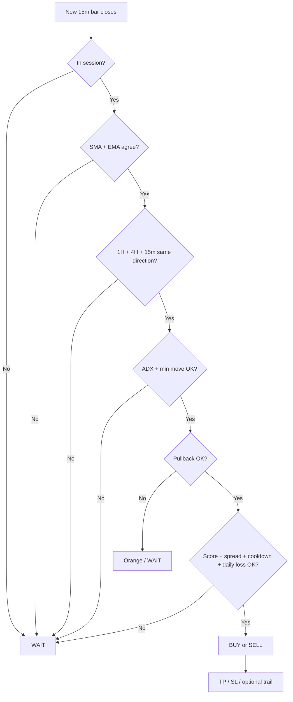

# AutoForexBot — Strategy Guide (Simple)

Read this on a **15-minute chart**. The bot thinks in **15m bars**, but also checks **1 hour** and **4 hour** before entering.

---

## 1. The big picture (one sentence)

**Only trade when short-term moving averages agree, higher timeframes agree, the market has enough momentum — and price pulled back instead of chasing a top or bottom.**

---

## 2. What you see on the chart

### Indicator (`AFB` — signals only)

| On chart | Meaning |
|----------|---------|
| **Yellow line** | Signal line = average of fast SMA(9) and fast EMA(9). Price near this line = “decision zone”. |
| **BUY** label (green) | All entry rules passed on a **closed** 15m bar. |
| **SELL** label (red) | Same, but bearish. |
| **WAIT** (big label) | No trade right now — something failed (see section 4). |

### Strategy (`AFB Strat` — backtest / simulated trades)

Everything above, plus:

| On chart | Meaning |
|----------|---------|
| **Red line** | Active stop loss (moves if trailing is on). |
| **Green line** | Active take profit. |
| **Gray background** | Outside trading session (no new entries). |
| **Orange background** | Trend looks OK but **pullback filter** blocked the entry (chasing move). |
| **Red tint** | Daily loss limit hit — no new entries today. |
| **Top-right table** | Score, daily drawdown, floating PnL, spread, cooldown. |

---

## 3. Chart setup (required)

1. **Timeframe:** 15 minutes (not 1h, not 5m for signals).
2. **Symbol:** Any — forex, crypto, gold, indices, stocks.
3. **Asset setting:** `Auto` (or pick Forex / Crypto / etc. if detection is wrong).

---

## 4. Entry rules — ALL must pass

Signals fire **once per closed 15m candle** (not mid-bar).

### Step A — Moving average agreement (the core idea)

Two pairs must **agree on direction**:

- **SMA 9** vs **SMA 21**
- **EMA 9** vs **EMA 21**

| Condition | BUY | SELL |
|-----------|-----|------|
| Fast above slow | Both SMA and EMA bullish | — |
| Fast below slow | — | Both SMA and EMA bearish |
| They disagree | **No trade** | **No trade** |

Also: the **previous bar** must still show the same side (confirmation = 1 bar).

**On chart:** Yellow line rising with price above slow MAs → bullish bias. Labels only appear when everything else passes too.

---

### Step B — Higher timeframe trend (1H + 4H + 15m)

Uses the **last closed candle** on each timeframe:

- Green candle (close > open) = bullish
- Red candle (close < open) = bearish

| For BUY | For SELL |
|---------|----------|
| 1H last candle = green | 1H last candle = red |
| 4H last candle = green | 4H last candle = red |
| 15m last candle = green | 15m last candle = red |

**Why:** Stops buying into a drop on higher timeframes (and vice versa).

**On chart:** You might see MAs bullish but **no BUY** because 4H just printed a red candle.

---

### Step C — ADX (trend strength)

**ADX(14)** on 15m must be above a floor:

| Asset | Min ADX |
|-------|---------|
| Forex | 22 |
| Crypto | 18 |
| Commodity / Stock / Index | 22 |

**On chart:** Choppy flat market → low ADX → **WAIT**, even if MAs cross.

---

### Step D — Min move (MAs must be separated enough)

Fast and slow MAs must be separated by at least:

| Asset | Min separation |
|-------|----------------|
| Forex | 3 pips |
| Crypto | 25 points ($25 on BTC if pip=1) |
| Commodity | 12 pips |
| Stock / Index | 25 points |

**On chart:** MAs tangled together → weak signal → no entry.

---

### Step E — Pullback filter (don’t chase tops/bottoms)

This blocks “late” entries before reversals.

**For BUY (uptrend):**

1. Price recently **dipped** toward the MA zone (last 5 bars).
2. Price is **not too far above** slow MA (not extended).
3. Price is **inside the MA ribbon** (between slow MA and fast MAs).
4. **RSI** dipped and is turning up (not overbought chase).
5. **+DI > -DI** (buyers stronger than sellers).

**For SELL:** mirror logic (rally into MAs, RSI rolling down, -DI > +DI).

**On chart:**

- Orange background = MAs say trade, but pullback filter says **no** (often near a local top/bottom).
- Good BUY = dip to yellow line, bounce, then **BUY** label.

```
Good BUY (pullback):          Bad (blocked / orange):
      /\                           /\
     /  \  ← dip                  /    \  ← extended top
────/────\/── yellow line    ───/──────\── no BUY or orange
```

---

### Step F — Extra filters (strategy + MT5 EA only)

| Filter | What it does | On chart / HUD |
|--------|----------------|-----------------|
| **Session** | Only enter in UTC hours (crypto = 24h) | Gray background when off |
| **Spread** | Skip if spread too wide | HUD: Spread HIGH |
| **Cooldown** | Wait X minutes after last trade | HUD: Cooldown WAIT |
| **Daily loss** | Stop entries if down 2% today | Red background, HUD Daily DD |
| **Bot score** | Quality score 0–100, need ≥ 70 | HUD: Score red if low |
| **Floating guard** | Close losers if open PnL ≤ -1.8% | HUD: Float red; may force exit |

**Bot score** mixes: signal strength, spread quality, ADX strength, RSI alignment.

---

## 5. Exit rules (when a trade closes)

### Take profit (TP) and stop loss (SL)

Set per asset (you can customize). Examples:

| Asset | TP | SL | Risk:Reward |
|-------|----|----|-------------|
| Forex | 25 pips | 15 pips | ~1.7:1 |
| Crypto (default) | 200 | 100 | 2:1 |
| Crypto (your test) | 2000 | 1000 | 2:1 |
| Commodity | 80 | 40 | 2:1 |
| Stock / Index | 160 | 80 | 2:1 |

**On chart (strategy):** Green line = TP, red line = SL from entry.

### Trailing stop (optional — often ON by default)

When profit reaches **trail start**, stop loss moves in your favor.

| Asset | Trail start | Trail distance |
|-------|-------------|----------------|
| Forex | 10 pips | 8 pips |
| Crypto | 50 | 50 |
| Commodity | 30 | 15 |
| Stock | 50 | 25 |

**Important:** Tight trailing + wide SL = many small wins, few big losses → **high win % but can still lose money**. For wide TP/SL (e.g. 2000/1000), turn trailing **OFF** or scale trail to match.

**Turn off trailing in TradingView:** Strategy settings → Filters → **Trailing stop = OFF**.

### Floating loss guard (MT5 + strategy)

If open trades lose more than **~1.8%** of balance:

1. Close losing positions.
2. Optionally close everything if still below limit.
3. Block new entries until floating PnL recovers.

---

## 6. What a good setup looks like on the chart

### BUY example

1. **4H and 1H** last candles green (check higher TF or trust the bot).
2. Price **above** yellow line; SMA/EMA fast above slow.
3. Price **pulled back** to the yellow/MA zone (not at a spike high).
4. **BUY** appears on **close** of 15m bar.
5. Strategy shows **red SL below**, **green TP above**.

### SELL example

Mirror: red HTF candles, price rallies into MAs from below, **SELL** on close.

### WAIT (no label / gray WAIT)

Common reasons:

- Wrong timeframe (not 15m).
- MAs disagree.
- ADX too low.
- Outside session.
- Pullback filter blocked (orange).
- Score below 70.
- Cooldown or daily loss active.

---

## 7. Flow diagram



---

## 8. Three tools — what each does

| Tool | Auto-trades? | Use for |
|------|----------------|---------|
| **AFB indicator** | No | Watch BUY/SELL/WAIT on chart |
| **AFB Strat strategy** | Simulated only | Backtest + forward test in Strategy Tester |
| **MT5 EA** | Yes (demo/live) | Real automatic trading |

TradingView **Paper Trading / broker** does **not** auto-run the Pine strategy — you trade manually or use MT5.

---

## 9. Numbers that matter (not just win rate)

| Metric | Good sign | Bad sign |
|--------|-----------|----------|
| **Profit factor** | > 1.0 | < 1.0 (you lose money) |
| **Avg win vs avg loss** | Win ≈ TP size, loss ≈ SL size | Tiny wins, huge losses |
| **Win rate** | Nice extra | 80%+ can still lose if losses are big |

Always check **List of trades** in Strategy Tester, not only win %.

---

## 10. Quick checklist before you trust a signal

```
☐ Chart is 15 minute
☐ Asset type correct (Auto or manual)
☐ Yellow line + MA direction match the label (BUY/SELL)
☐ Not orange background (pullback block)
☐ HUD score ≥ 70 (if using strategy)
☐ TP/SL match what you expect (check green/red lines)
☐ Trailing OFF if testing wide TP/SL (e.g. BTC 2000/1000)
```

---

## 11. File reference

| File | Purpose |
|------|---------|
| `AutoForexBot_Core.pine` | Simple chart signals |
| `AutoForexBot_Strategy.pine` | Full backtest with risk rules |
| `mql5/Experts/AutoForexBot/*.mq5` | Live/demo auto trading |
| `mql5/Include/AutoForexBot/AutoForexBotCore.mqh` | Shared EA logic |

---

*Last updated to match: MA 9/21 consensus, H1+H4+15m trend, ADX floor, min move, pullback filter, bot score, session, spread, cooldown, daily loss, floating guard, TP/SL/trailing.*

---

## 12. Nice to have — few trades & how to test more activity

### Why there are not many trades

**This is normal.** The bot is built for **quality over quantity**. Every **closed 15m bar** is checked, but a trade only fires when **all** filters pass at once.

Your BTC backtest (~10 trades in 2 months ≈ **5 per month**) is typical for this setup — not a bug.

| Layer | What it blocks | How often |
|-------|----------------|-----------|
| **Pullback filter** | Chasing tops/bottoms | **Very often** — biggest reducer |
| **1H + 4H + 15m** same direction | Mixed/choppy markets | Often |
| **SMA + EMA** must agree | Weak or conflicting trend | Often |
| **ADX** floor | Flat/choppy price | Sometimes |
| **Min move** (e.g. 25 pts crypto) | MAs too close together | Sometimes |
| **Bot score ≥ 70** | “Low quality” setups | Sometimes |
| **Cooldown** (~28 min crypto) | Back-to-back entries | After each trade |
| **One trade at a time** | New entry while position open | While waiting for TP/SL |

Wide **TP/SL** (e.g. BTC 2000/1000) also keeps trades open **longer**, so fewer new entries per month.

**Rough math (BTC, 15m):**

- ~2,880 bars per month
- Often only **1 valid setup every few days** after all filters
- **5–15 trades/month** is typical
- **10 in 2 months** is on the low side but still normal

**More trades ≠ more profit.** A high win rate can still lose money if wins are small and losses hit full SL (see section 9).

---

### How to see what is blocking entries on the chart

| What you see | Meaning |
|--------------|---------|
| **Orange background** | MAs/trend OK, but **pullback filter** blocked entry |
| **Gray background** | Outside **session** — no new entries |
| **WAIT** label | One or more rules failed |
| **HUD Score red** | Bot score below minimum |
| **HUD Cooldown WAIT** | Too soon after last trade |
| **No label, flat MAs** | No consensus — most common in chop |

---

### If you want more trades — relax filters in this order

Change **one thing at a time** in Strategy → **Inputs**, re-run Strategy Tester, and compare **trade count**, **profit factor**, and **avg win vs avg loss** — not win rate alone.

| Step | Setting | Change | Expected effect |
|------|---------|--------|-----------------|
| **1** | Pullback filter | **OFF** | **Largest** increase (often 2–3× more signals). More bad entries at tops/bottoms. |
| **2** | Min bot score | `70` → `60`, or Bot score **OFF** | More marginal setups |
| **3** | Cooldown | `28` → `15` or `0` | Trades closer together |
| **4** | ADX floor (crypto) | `18` → `15` | Trades in weaker trends |
| **5** | Min move (crypto) | `25` → `15` points | Trades when MAs are closer |
| **6** | TP / SL | e.g. 2000/1000 → 200/100 | Positions close faster → room for more entries (different risk) |

**Turn off trailing** when testing wide TP/SL so exits match your targets (Filters → **Trailing stop = OFF**).

---

### Suggested testing presets

Use these as starting points in TradingView Inputs. Always backtest **6+ months** before trusting results.

#### Strict (default — fewest trades, highest quality)

| Setting | Value |
|---------|-------|
| Pullback filter | ON |
| Min bot score | 70 |
| Cooldown | 28 min (crypto) / 30 (others) |
| Trailing | OFF for wide TP/SL tests |

#### Balanced (medium activity)

| Setting | Value |
|---------|-------|
| Pullback filter | ON |
| Min bot score | 60 |
| Cooldown | 15 min |
| Trailing | Match TP scale or OFF |

#### More signals (most activity — test carefully)

| Setting | Value |
|---------|-------|
| Pullback filter | **OFF** |
| Min bot score | 60 or OFF |
| Cooldown | 15 min or 0 |
| Trailing | OFF until exits are profitable |

---

### Step-by-step test plan (nice to have)

Run each step on the **same date range** and write down results in Strategy Tester → **Overview**:

```
1. Baseline     → Strict preset, note: trades, profit factor, net PnL
2. + Pullback OFF → compare trade count (expect big jump)
3. + Score 60   → compare profit factor (did quality drop?)
4. + Cooldown 15 → compare trade count
5. Pick the preset that keeps profit factor > 1.0 with acceptable drawdown
```

**Checklist per test run:**

```
☐ Same symbol and date range (e.g. BTCUSDT, 6 months)
☐ Chart = 15m
☐ Trailing OFF when using wide TP/SL
☐ Note: Total trades, Profit factor, Avg win, Avg loss, Max drawdown
☐ List of trades — confirm exits hit TP/SL, not tiny trail wins
```

---

### What not to change (without heavy retesting)

| Keep | Why |
|------|-----|
| **1H + 4H + 15m trend** | Core strategy — removing it changes what the bot is |
| **SMA + EMA agreement** | Main signal engine |
| **15m chart** | Entry timing is built for M15 bar close |

Do not chase “50 trades/month” with every strict filter still ON — they work against each other.

---

### MT5 EA (same behavior)

The EA uses the same filters. Few trades on MT5 demo is expected unless you change inputs:

| Input | More trades |
|-------|-------------|
| `InpUsePullbackFilter` | `false` |
| `InpMinBotScore` | `60` |
| `InpCooldownMinutes` | `15` or lower |

Enable **`InpDebugMode = true`** → Experts tab shows `SKIP: pullback_filter`, `SKIP: low_score`, etc.

---

### Optional future improvement

A single **Trading mode** dropdown (`Strict` / `Balanced` / `More signals`) in Pine and MT5 could apply the preset table above automatically — one setting instead of tuning each filter by hand.

---

### Quick reference — trade frequency vs quality

| Mode | Trades/month (typical BTC) | Quality | Best for |
|------|----------------------------|---------|----------|
| Strict | ~3–8 | Highest | Live / prop / careful testing |
| Balanced | ~8–15 | Medium | Finding a middle ground |
| More signals | ~15–30+ | Lower | Learning the chart, more samples |

**Bottom line:** Few trades means filters are working. To get more activity, relax **pullback** and **bot score** first, then re-backtest and watch **profit factor** — not just trade count.
